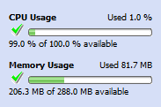
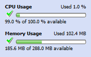
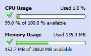
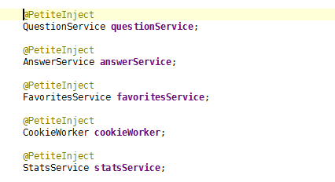
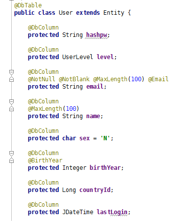

# Uphea 

*Uphea* is an open-source real-world web application example built on
*Jodd* frameworks. It presents many best-practices of using *Jodd*.
Moreover, *Uphea* gives an excellent overview of key points and main
strengths of *Jodd* framework; you will be able to feel the \'unbearable
lightness\' of Java web development. We decided to give you a chance to
examine the real web application, and not only some half-baked pet-store
example. *Uphea* will also be upgraded and enhanced in time, showing
more and more *Jodd*s features.

**site url:** [uphea.com][1]

(site is no longer alive, but you can see some screenshots and list of features)

## Download

Hey, you can try *Uphea*! Just download prepared Tomcat 7 bundle:

[uphea.zip - Tomcat 7 bundle (10 MB)](uphea.zip)
{: .download}

Unpack the bundle somewhere and execute `run-uphea.bat` or
`run-uphea.sh` (`cmod +x` first!). And that's all! When *Uphea* web
application is started for the first time, database will be initialized
with demo data, so please be patient.

Then open your favorite browser and enter the following URL:
[http://localhost:8080][2] to see *Uphea* in action.

### Source code

Soruce code is available on **GitHub**\:

[https://github.com/oblac/uphea][3]
{: .download}

## Key points

* [Small project size](#small-project-size)
* [Fast (re)start](#fast-restart)
* [Small memory footprint](#small-memory-footprint)
* [Template SQL for easy SQL scripts](#template-sql-for-easy-sql-scripts)
* [Auto-magic configuration](#authentication-and-authorization-as-you-like)
* [Easy dependency injection](#easy-dependency-injection)
* [URL rewriting](#url-rewriting)
* [File upload](#file-upload)
* [Easy REST](#easy-rest)
* [Easy REST mappings](#easy-rest-mapping)
* [CSRF shield](#easy-rest-mapping)

* [Running web app out of container](#running-web-app-out-of-container)
* [Easy transactions](#easy-transactions)
* [Custom annotations](#custom-annotations)
* [Don't write common SQL code](#dont-write-common-sql-code)
* [Form validation](#form-validation)
* [Authentication and authorization as you like](#authentication-and-authorization-as-you-like)
* [Rich entity DB mappings](#rich-entity-db-mappings)
* [Debug SQL mode for readable statements](#optimize-html-and-resources)
* [Optimize HTML and resources](#optimize-html-and-resources)

More points and more details will be added...

## Small project size

Imagine... full blown web application with just **less then 3 MB** of
runtime libraries; total of 3.2 MB of libraries.

{: .b}

## Fast (re)start

Due to lightness of the project, Tomcat (re)starts really fast, **just
in 6 seconds** on developers machine! Compare this to 20-30 seconds of
common Spring/Hibernate web project. Calculate the difference and
multiply by number of times you (re)start the application daily: you
will have more time:)

{: .b}

## Small memory footprint

As expected, memory footprint of live application **is low** (typically
200MB - 140 MB) and therefore it is a perfect match for just **basic
Java hosting plans**. For comparison, similar project using other
standard technologies leaves 60 MB of free memory or less.

{: .b}
{: .b}
{: .b}

## Running web app out of container

With *Jodd*, you can simply run and test your web application from
**command line**! Simple get any bean from *Petite* container and use
it! [Read more...][4]

{: .b}

## Easy transactions

In *Uphea*, we consider that **Unit-Of-Work** is encapsulated in Madvoc
POJO action. Business services, from application layer, provide
low-level logic that is used and combined in actions. Transactions are
marked with annotations on action methods - and that is all! Of course,
nothing stops you to mark any other method as transactional and to work
in other way.

{: .b}

## Custom annotations

Several frameworks in *Jodd* (*Madvoc*, *JTX*) allows users to define
and use custom annotations with predefined values, to prevent repeating
of common code. For example, annotations usage from previous example
above, may be replaced with custom annotations that defines exactly the
same element values - just with less code.

{: .b}

## Don't write common SQL code

With *Jodd Db* you don't have to write common SQL code, for inserting,
updating, finding by id and so on. Just use `AppDao` for that.

{: .b}

## Template SQL for easy SQL scripts

Write (and also simplify) your SQLs using entity and property names.

{: .b}

## Form validation

Did you know that besides the *VTor* (a Java validation framework in
*Jodd*), you also have a [JavaScript tool][5] that simplifies form
validation. It also offers a way to validate a form while user enters
data (live validation), to validate using Ajax and so on.

{: .b}

## Authentication and authorization as you like

*Jodd* also offers `AuthInterceptor`, a Madvoc interceptor that can be
subclassed and used for auth\* in standard ways. Using this interceptor
it is easy to create Acegi-alike auth\* system, where you can put
definitions in xml files, or you can use some naming conventions and so
on. In *Uphea* implementation of auth system is very easy; but this can
be changed and enhanced to match most requirements.

{: .b}

## Auto-magic configuration

If you take a look at the code, you will notice that there are **no
configuration files** or code for *Petite* beans, *Db* entities and
*Madvoc* actions. *Jodd*, by default, offers auto-magic configuration:
the process of optimized (raw bytecode is examined) class path scanning
and automatic configuration. So all you have to do is to put annotations
in your POJOs. Of course, since in the nutshell all *Jodd* configuration
is based on Java API, it is possible to have your own configuration
system if you like (XML,...).

## Easy dependency injection

*Petite* offers easy dependency injection **using annotations**; not
only for wiring services, but also to inject services into *Madvoc*
actions.

{: .b}

## Rich entity DB mappings

*Jodd DB* offers to easily map database columns to various entity types.
As seen in the `User` class, columns may be mapped to all common Java
types, including primitives and Jodds types (such `JDateTime`).
Moreover, it is very easy to add custom mappings, such as for custom
enumeration (see `UserLevel`).

{: .b}

## URL rewriting

*Madvoc* offers nice urls using URL rewriting with power of Java. [Read
more...][6]

{: .b}

## File upload

*Madvoc* works with uploaded files in the very same way as with
parameters and attributes, using injection and annotated action fields.

{: .b}

## Debug SQL mode for readable statements

If you ever logged prepared statement you will see bunch of \'**?**\'
instead of real values. Not with *Jodd*!

{: .b}

## Easy REST

Just anotate an action with required method name. Moreover, it is
possible to control URL name extension per HTTP method name, e.g. to
have all POST actions end with \'.do\'.

{: .b}

## Easy REST mapping

With *Madvoc* it is possible to build more complex URL mappings, like
the following one:

{: .b}

## CSRF shield

A little, but precious tool. Again, easily available in *Madvoc*
actions.

{: .b}
{: .b}

## Optimize HTML and resources

*HTML stapler* is a great tool to optimize multiple HTML resources into
one big resource file, **transparently**! As result, instead of
downloading several CSS and JS files, only two resource bundles will be
downloaded. Moreover, *Lagarto* parser can optimize the HTML page and
strip all unnecessary whitespaces.

{: .b}

[1]: http://uphea.com
[2]: http://localhost:8080
[3]: https://github.com/oblac/uphea
[4]: http://code.google.com/p/uphea/source/browse/trunk/mod/web/src/com/uphea/WebRunner.java
[5]: http://code.google.com/p/jodd/source/browse/trunk/mod/jodd-joy/www/reform.js
[6]: http://code.google.com/p/uphea/source/browse/trunk/mod/web/src/com/uphea/AppActionPathRewriter.java
